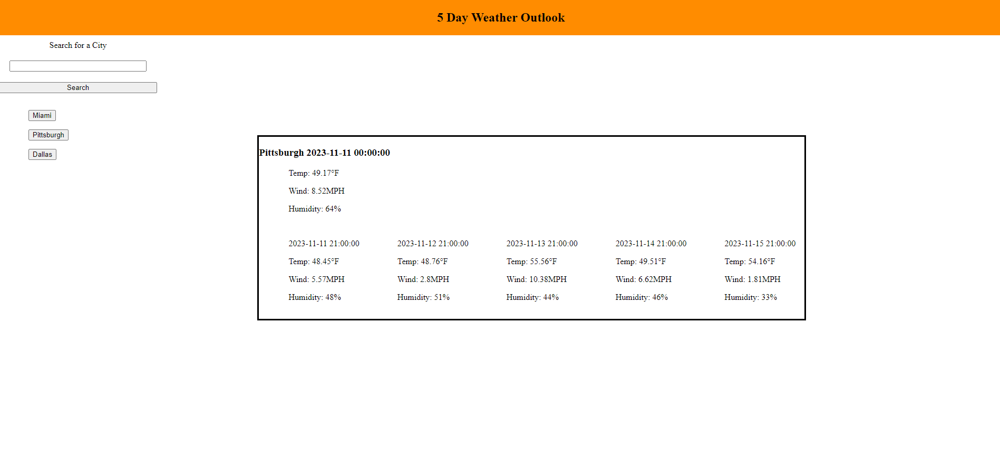

# 5day-weather-outlook

## Description

This site is an easy to use weather outlook for the next five days. Utilizes the openweather 5day api to fetch weather data. This api requires the lat and lon of the city to return the weather. To get the lat and lon openweather geolocator api was utilized. This api uses the user input city to return the lat and lon necessary to make the 5 day weather fetch. 

## Usage

This site can be used to view todays weather along with the weather for the next 5 days based off the searched city or by clicking the button generated from the 6 most recent searches.

## License

MIT license

---